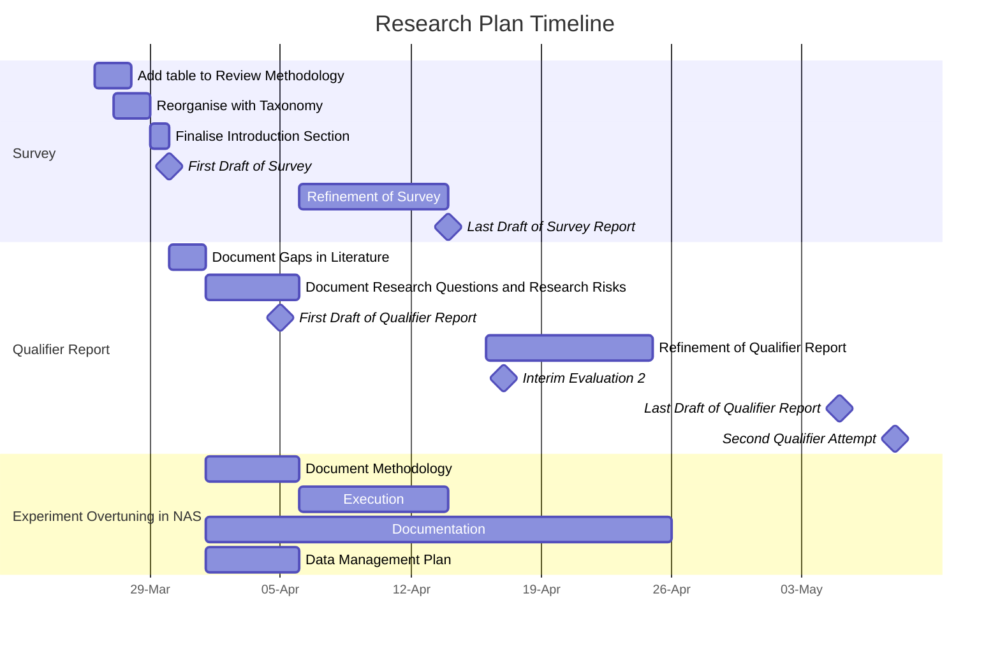

```mermaid
gantt
    title Research Plan Timeline
    dateFormat YYYY-MM-DD
    axisFormat %d-%b

    section Survey
    Add table to Review Methodology :a1, 2026-03-26, 2d
    Reorganise with Taxonomy :a2, 2026-03-27, 2d
    Finalise Introduction Section :a3, 2026-03-29, 1d
    First Draft of Survey :milestone, m1, 2026-03-30, 0d
    Refinement of Survey :a4, 2026-04-06, 8d
    Last Draft of Survey Report :milestone, m2, 2026-04-14, 0d

    section Qualifier Report
    Document Gaps in Literature :b1, 2026-03-30, 2d
    Document Research Questions and Research Risks :b2, 2026-04-01, 5d
    First Draft of Qualifier Report :milestone, m3, 2026-04-05, 0d
    Refinement of Qualifier Report :b3, 2026-04-16, 9d
    Interim Evaluation 2 :milestone, m4, 2026-04-17, 0d
    Last Draft of Qualifier Report :milestone, m5, 2026-05-05, 0d
    Second Qualifier Attempt :milestone, m6, 2026-05-08, 0d

    section Experiment Overtuning in NAS
    Document Methodology :c1, 2026-04-01, 5d
    Execution :c2, 2026-04-06, 8d
    Documentation :c3, 2026-04-01, 25d
    Data Management Plan :c4, 2026-04-01, 5d
```