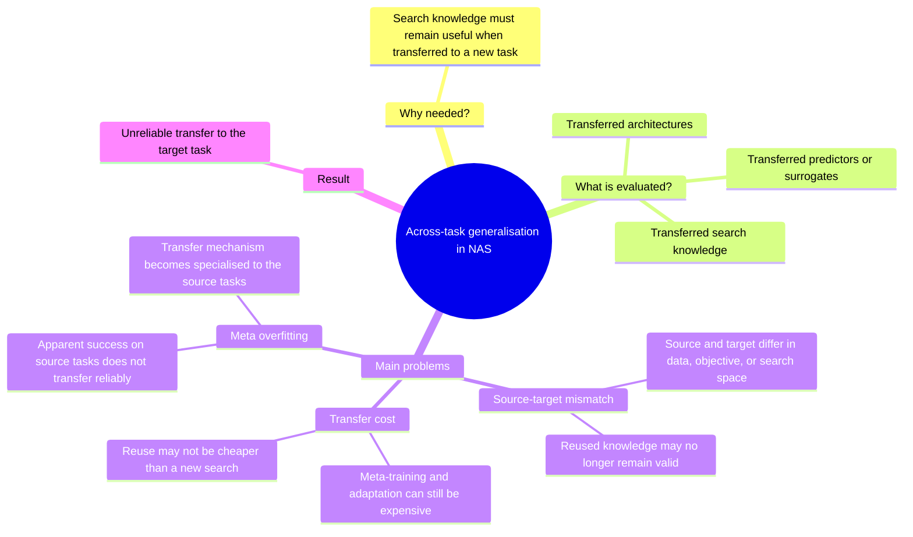

```mermaid
mindmap
  root((Across-task generalisation in NAS))
    Why needed?
      Search knowledge must remain useful when transferred to a new task
    What is evaluated?
      Transferred architectures
      Transferred predictors or surrogates
      Transferred search knowledge
    Main problems
      Transfer cost
        Meta-training and adaptation can still be expensive
        Reuse may not be cheaper than a new search
      Source-target mismatch
        Source and target differ in data, objective, or search space
        Reused knowledge may no longer remain valid
      Meta overfitting
        Transfer mechanism becomes specialised to the source tasks
        Apparent success on source tasks does not transfer reliably
    Result
      Unreliable transfer to the target task
```