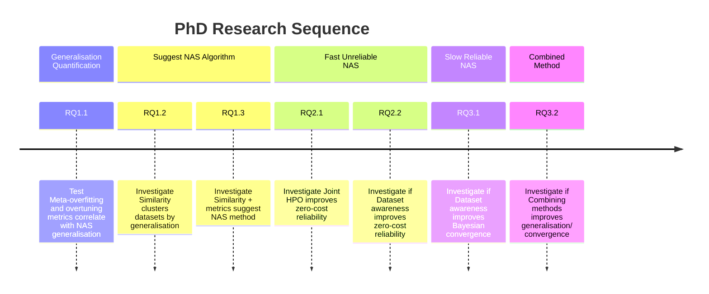

```mermaid
timeline
    %%{init: {'themeVariables': { 'fontSize': '20px' }}}%%
    title PhD Research Sequence

    section Generalisation <br>Quantification
        RQ1.1 : Test Meta-overfitting and overtuning metrics correlate with NAS generalisation

    section Suggest NAS Algorithm
        RQ1.2 : Investigate Similarity clusters datasets by generalisation
        RQ1.3 : Investigate Similarity + metrics suggest NAS method

    section Fast Unreliable <br> NAS
        RQ2.1 : Investigate Joint HPO improves zero-cost reliability
        RQ2.2 : Investigate if Dataset awareness improves zero-cost reliability

    section Slow Reliable <br> NAS
        RQ3.1 : Investigate if Dataset awareness improves Bayesian convergence

    section Combined <br> Method
        RQ3.2 : Investigate if Combining methods improves generalisation/ convergence
```