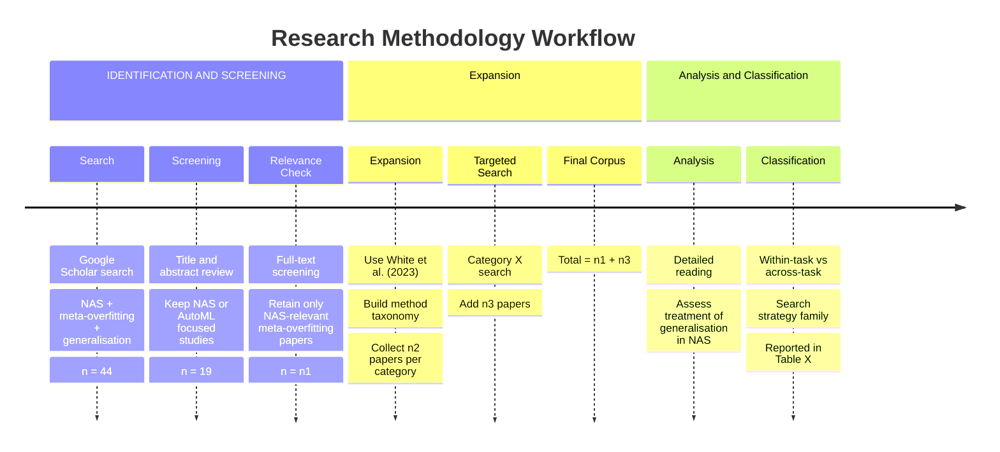

```mermaid
%%{init: {'themeVariables': { 'fontSize': '22px' }}}%%
timeline
    title Research Methodology Workflow

    section IDENTIFICATION AND SCREENING
    Search : Google Scholar search
           : NAS + meta-overfitting + generalisation
           : n = 44

    Screening : Title and abstract review
              : Keep NAS or AutoML focused studies
              : n = 19

    Relevance Check : Full-text screening
                    : Retain only NAS-relevant meta-overfitting papers
                    : n = n1

    section Expansion
    Expansion : Use White et al. (2023)
              : Build method taxonomy
              : Collect n2 papers per category

    Targeted Search : Category X search
                    : Add n3 papers

    Final Corpus : Total = n1 + n3

    section Analysis and Classification
    Analysis : Detailed reading
             : Assess treatment of generalisation in NAS

    Classification : Within-task vs across-task
                   : Search strategy family
                   : Reported in Table X
```