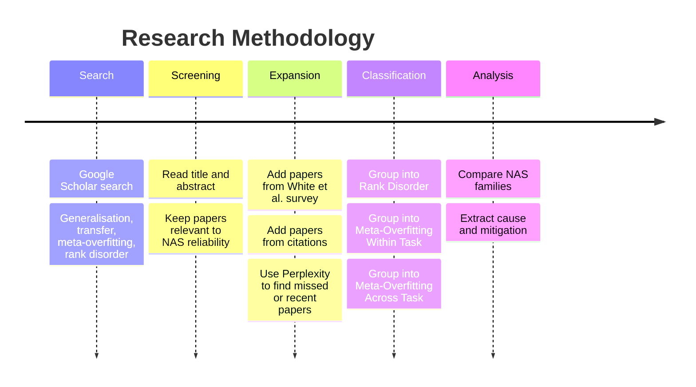

```mermaid
%%{init: {'themeVariables': { 'fontSize': '22px' }}}%%
timeline
    title Research Methodology

    Search : Google Scholar search
           : Generalisation, transfer, meta-overfitting, rank disorder

    Screening : Read title and abstract
              : Keep papers relevant to NAS reliability

    Expansion : Add papers from White et al. survey
              : Add papers from citations
              : Use Perplexity to find missed or recent papers

    Classification : Group into Rank Disorder
                   : Group into Meta-Overfitting Within Task
                   : Group into Meta-Overfitting Across Task

    Analysis : Compare NAS families
             : Extract cause and mitigation
```